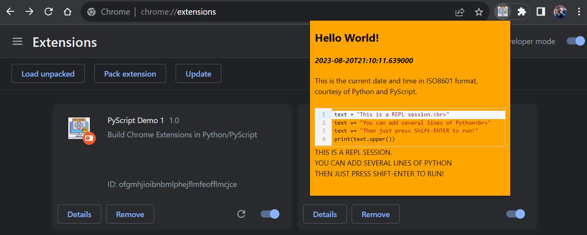

# pyscript-local-runtime

This repository gives a framework for running PyScript and all its runtime dependencies locally e.g. to create Chrome extension using Python, or offline web apps using PyScript without internet access.

PyScript and its dependency Pyodide continue to evolve and this demo is frozen at Pyodide v0.21.3. You're strongly advised to check out the [latest version of PyScript](https://pyscript.net/).

All the files you need to run PyScript (at v0.21.3) are in the `/runtime` directory and you can also download them on POSIX using wget...
```shell
cd runtime
source setup.sh
```

or on Windows using the helper script supplied:
```
cd runtime
python setup.py
```

## **EXAMPLE CHROME EXTENSION**


This example is a simple Chrome Extension which creates a Popup box and renders the time using Python's `datetime` module.


* The Python script is wrapped inside some simple HTML boiler-plate code in `popup.html`.
* Icons are in `/icons`
* Other magic required for Chrome to recognise this as an extension are in `manifest.json`.

`popup.html` must include a `<py-config>` block as follows:

```html
<py-config>
      [[runtimes]]
      src = "runtime/pyodide.js"
      name = "pyodide-0.21.3"
      lang = "python"
</py-config>
```

And also these two lines to load PyScript locally into the browser:
```html
<link rel="stylesheet" href="runtime/pyscript.css" />
<script defer src="runtime/pyscript.js"></script>
```

Now you're ready to load the unpacked extension into Chrome and run it [following this tutorial](https://www.codeinwp.com/blog/how-to-write-a-chrome-extension/#:~:text=After%20you%20have%20your%20manifest%20file%20in%20place%2C%20you%20can%20load%20up%20your%20extension%20in%20the%20Chrome%20browser%3A).

Further information about getting started with Chrome Extensions is available [here](https://developer.chrome.com/docs/extensions/mv3/getstarted/).

All the best,
Pete

https://github.com/PFython

## **CREDITS**

A big "Thank You" to https://github.com/tedpatrick (Engineering Manager at Anaconda) for pointing me in the right direction.

If this code helps you save time and focus on more important things, please feel free to to show your appreciation by starring the repository on Github.

I'd also be delighted if you wanted to:

<a href="https://www.buymeacoffee.com/pfython" target="_blank"></a>

